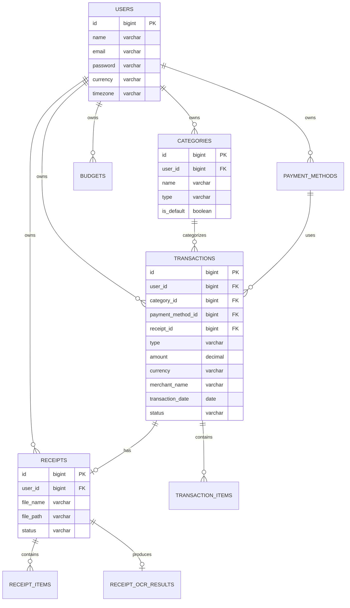

# Database Specification

## ERD (Entity Relationship Diagram)

## Conventions
- **Ownership**: Every user-owned record must include `user_id`.
- **Soft Deletes**: Used across user-facing entities (Transactions, Categories, Budgets, Receipts) to allow recovery and preserve history.
- **Audit Logs**: Immutable records of every CUD action on critical entities.
